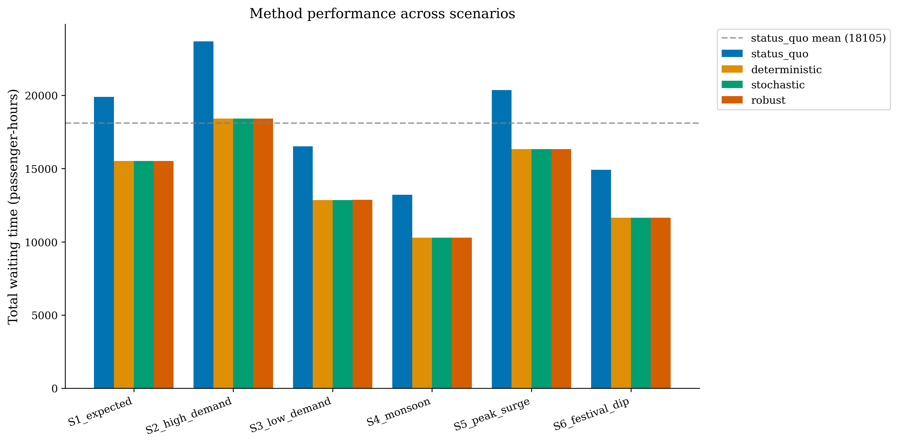
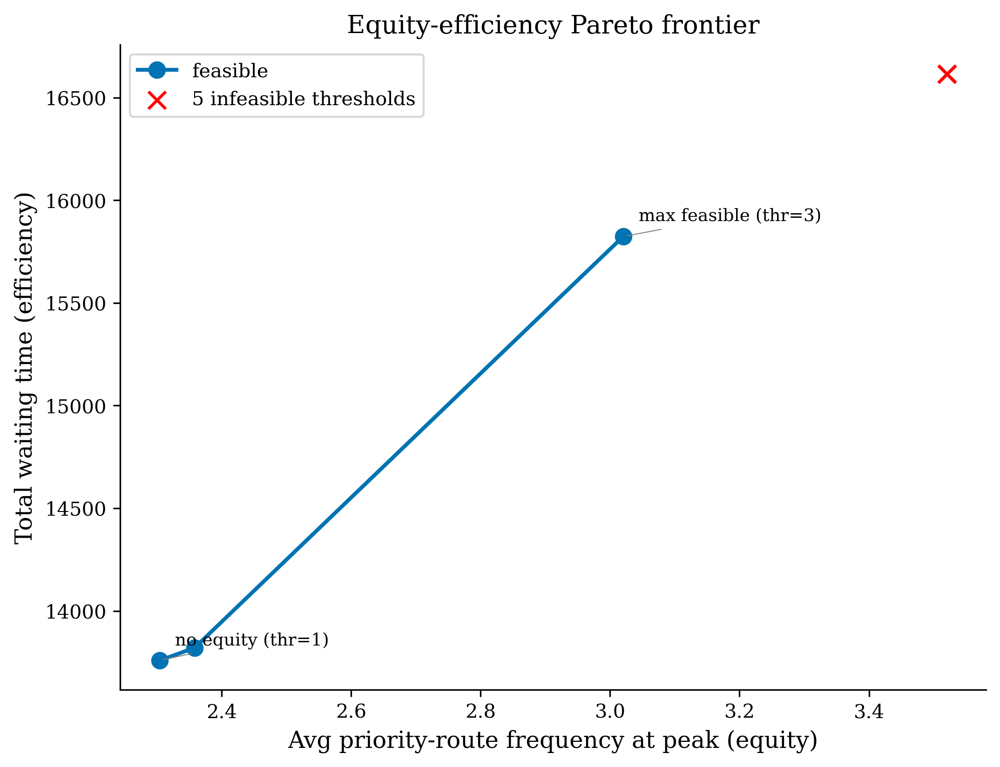

# Pune Bus Frequency Optimization (Synthetic Benchmark)

A predict-then-optimize benchmark for bus frequency allocation, evaluated on
a *synthetic* instance modelled after Pune's PMPML network. The pipeline
combines mixed-integer programming, demand forecasting, and decision-focused
learning to study how prediction quality and decision quality relate in
predict-then-optimize systems.

## Overview

The synthetic instance has the operational shape of PMPML (340 routes, eight
depots, ~1,800-bus fleet, peak/off-peak structure, equity priorities derived
from neighbourhood demographics) but ridership and weather are simulated. We
do **not** claim deployment-relevant numbers on real PMPML; the contribution
is methodological:

- a deterministic MIP with fleet, depot, equity, and operator-cost
  constraints, plus a $\lambda$-sweep that traces the rider-wait /
  operator-cost Pareto frontier (the headline "% improvement" depends
  strongly on $\lambda$);
- a forecasting pipeline with seven quantile heads and split-conformal
  calibration of the 80% prediction interval on the validation fold;
- a 20-seed sweep comparing four decision-focused training variants with a
  paired Wilcoxon signed-rank test for inference, rather than a single-seed
  point comparison.

## Methodology

### Stage 1: Deterministic optimisation

A mixed-integer program with 15,300 binary variables (340 routes &times; 5
periods &times; 9 frequency levels) chooses one frequency per (route, period).
Constraints enforce a global fleet cap, per-depot capacity, and an equity
floor of 3 buses/hour at peak for priority routes that serve lower-income
neighbourhoods. CBC solves it to optimality in under five seconds.

### Stage 2: Predict-then-optimize

XGBoost (depth 8, learning rate 0.03, 2,000 trees with early stopping) is
trained on hourly ridership over months 1-8, validated on 9-10, tested on
11-12. Quantile regression heads at 0.1 / 0.5 / 0.9 supply prediction
intervals; six demand scenarios derived from those quantiles drive a stochastic
MIP (probability-weighted expected wait) and a robust minimax MIP (worst-case
wait).

### Stage 3: Decision-focused learning

Standard MSE training treats all prediction errors equally. We compare two
decision-aware variants: (a) XGBoost with sample weights proportional to
&part;wait/&part;f, the downstream optimisation sensitivity; (b) a small
fully-connected neural network trained with an SPO+-style surrogate loss
that weights L1 errors by the same sensitivity. Both are evaluated by their
*decision regret* against the oracle that sees true demand.

## Key Results (synthetic instance, seed 42)

- **21.7% wait-time reduction** at λ=0 (no operator-cost penalty) — MIP
  optimum 15,823 vs status quo 20,198 passenger-hours. The optimum at
  λ=0 saturates the fleet (9,000 bus-periods across the five operating
  periods). At realistic λ the gap shrinks rapidly: λ=2 yields 17,759
  pass-hr at 7,695 bus-periods; λ=5 yields 20,665 pass-hr at 6,744
  bus-periods (essentially status-quo waiting time with fewer buses).
  See `results/tables/cost_wait_frontier.csv` for the full sweep.
- **XGBoost** achieves test RMSE 10.96, MAPE 16.8%, R² 0.895 on the
  harder DGP (latent day factor + hidden surge events + heavy-tail noise
  on a subset of routes), beating random forest (RMSE 11.60) and linear
  regression (RMSE 13.63).
- **80% prediction intervals** cover 67.1% of test observations from the
  raw quantile heads; split-conformal calibration on the validation fold
  raises empirical coverage to 77.3% (close to but slightly below the
  nominal 80% due to mild val→test distribution shift).
- **VSS = 0.10** and **EVPI = 1.57** passenger-hours — both positive but
  extremely small (≈1 part in 10⁴ of the objective).
- **Decision-focused NN vs XGBoost-MSE**: regret comparison over 20 seeds
  with a paired Wilcoxon signed-rank test; see
  `results/tables/decision_focused_summary.csv` and
  `decision_focused_wilcoxon.csv` for the inferential outcome on the
  current data. Regret is reported in passenger-hours, as a fraction of
  the objective, and in person-minutes total across the synthetic
  instance's ~800,000 daily riders, so the reader can judge operational
  significance directly.
- **Fleet sensitivity**: feasible from B=1,800 onward; the next 200 buses
  recover ~2,700 passenger-hours, the next 400 ~4,400 passenger-hours.
- **Pareto frontier**: equity floors 1, 2, 3 are feasible at B=1,800;
  floor 4 is the cliff (infeasible). On this instance the binding
  constraint at peak is fleet, not depot — depot caps are allocated
  proportional to each depot's minimum bus need (priority floor at k=3 +
  remaining routes at k=1) plus jitter, so per-depot capacity has slack.

### Scenario Comparison


### Equity-Efficiency Tradeoff


## Repository Structure

```
pune-bus-optimization/
&#9500;&#9472; data/                 raw/processed CSVs and fetcher
&#9500;&#9472; src/
&#9474;  &#9500;&#9472; audit.py           audit-log helpers
&#9474;  &#9500;&#9472; data_processing.py loaders + feature prep
&#9474;  &#9500;&#9472; deterministic_model.py   MIP + 4 baselines
&#9474;  &#9500;&#9472; demand_forecasting.py    LR / RF / XGBoost (incl. quantile)
&#9474;  &#9500;&#9472; stochastic_model.py      stochastic + robust + VSS/EVPI
&#9474;  &#9500;&#9472; decision_focused.py      decision-focused learning
&#9474;  &#9500;&#9472; sensitivity.py           fleet / Pareto / shadow prices
&#9474;  &#9492;&#9472; visualization.py         all 11 figures
&#9500;&#9472; dashboard/app.py        Streamlit dashboard
&#9500;&#9472; paper/main.tex          LaTeX paper + references.bib
&#9500;&#9472; results/tables/         CSV outputs
&#9500;&#9472; results/figures/        PNG figures
&#9500;&#9472; results/models/         saved XGBoost / NN models
&#9500;&#9472; scripts/run_all.py      master pipeline
&#9500;&#9472; tests/test_sanity.py    pytest sanity suite
&#9492;&#9472; audit.log               full run trace
```

## Installation & Usage

```bash
git clone https://github.com/juunnq/pune-bus-optimization.git
cd pune-bus-optimization
pip install -r requirements.txt
python scripts/run_all.py
```

### Interactive Dashboard

```bash
streamlit run dashboard/app.py
```

### Run Tests

```bash
pytest tests/test_sanity.py -v
```

## Paper

The accompanying paper is in `paper/main.tex`. To compile:

```bash
cd paper
pdflatex main.tex && bibtex main && pdflatex main.tex && pdflatex main.tex
```

## Citation

```bibtex
@misc{veluri2026pune,
  title={Decision-Focused Demand Learning for Equitable Bus Frequency
         Optimization},
  author={Veluri, Arjun},
  year={2026},
  howpublished={\url{https://github.com/juunnq/pune-bus-optimization}},
  note={Working paper}
}
```

## License

MIT
